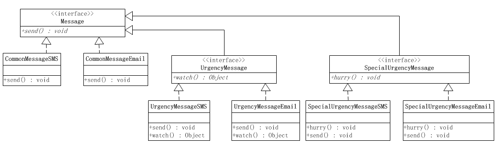
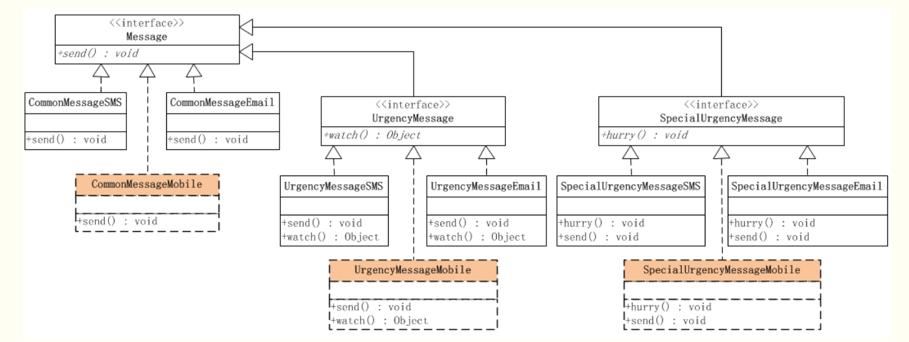
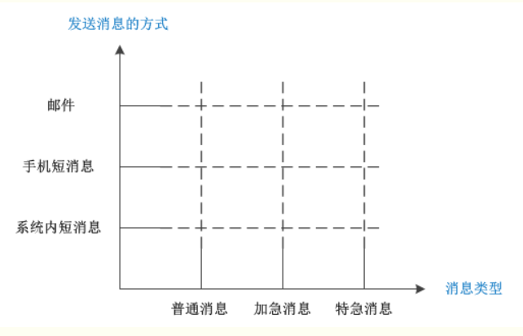
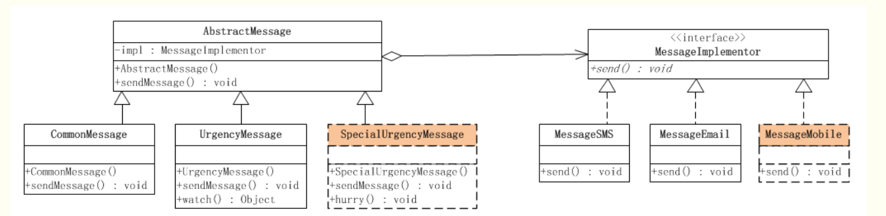

#通过这种继承的方式来扩展消息处理，会非常不方便。
1.实现加急消息处理的时候，必须实现系统内短消息和邮件两种处理方式，因为业务处理可能不同，在实现特急消息处理的时候，又必须实现系统内短信息和邮件两种处理方式。
2.这意味着，以后每次扩展一下消息处理，都必须要实现这两种处理方式，
3.这还不算完，如果要添加新的实现方式呢？

#假如要增加另外一个消息发送方式，那就是手机消息发送

###缺点：
- 扩展消息的种类不容易
- 如果要新加入一个消息的发送方式，比如所有消息实现量子通信发送，那么每个消息种类都要加入这种新的发送方式。
- 根本原因就在于：消息的抽象和实现是混杂在一起的，这就导致了一个纬度的变化会引起另一个纬度进行相应的变化，从而使得程序扩展起来非常困难

#使用桥梁模式来解决问题

