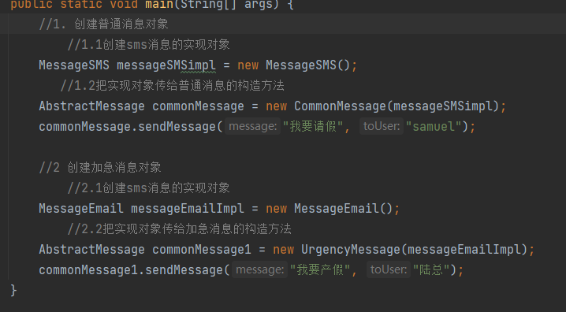

#使用桥梁模式来解决V1版本的问题
- 把抽象部分（消息的类型） 和实现部分（发送各个消息的方式） 分离
    - 
    - 
    - 
- 如果要增加 消息方式（比如手机消息消息MessageMobile），那么就新建一个MessageMobil 实现MessageImplementor
  - 不会影响现在的其他类和方法
  - 这个时候可以通过普通方式发送脑电波消息， 也可以通过加急方式发送脑电波消息
- 如果要增加一个新的消息类型（可有可无的消息类型 specialUrgencyMessage） 
  - 首先新增一个类 specialUrgencyMessage 继承自AbstractMessage 抽象类，除了实现抽象方法本身要求的方法，可以自定义功能hurry()
